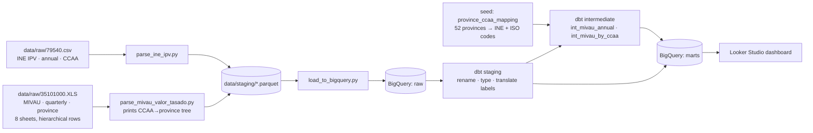
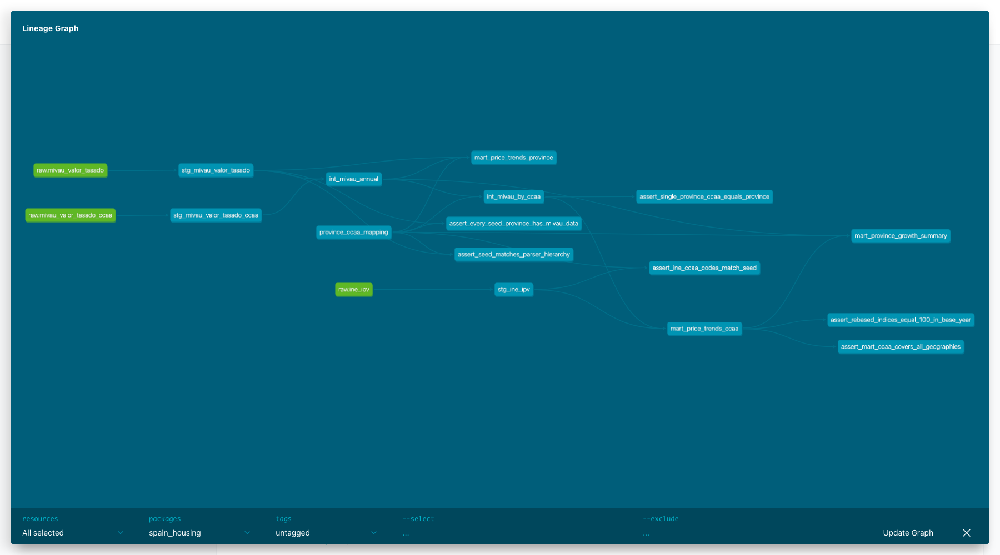
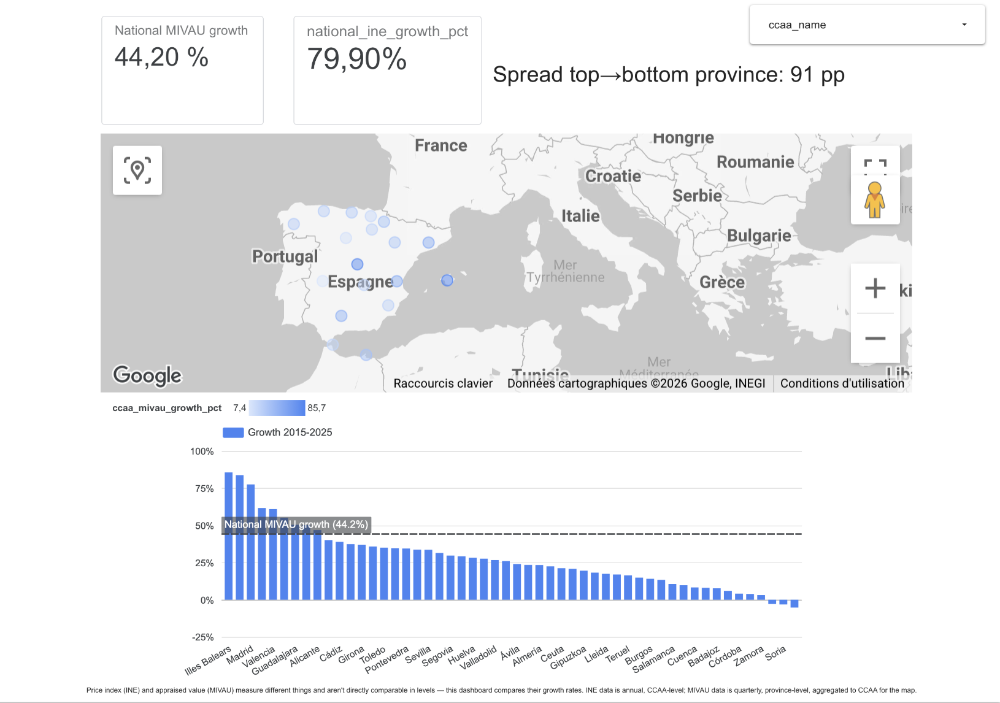
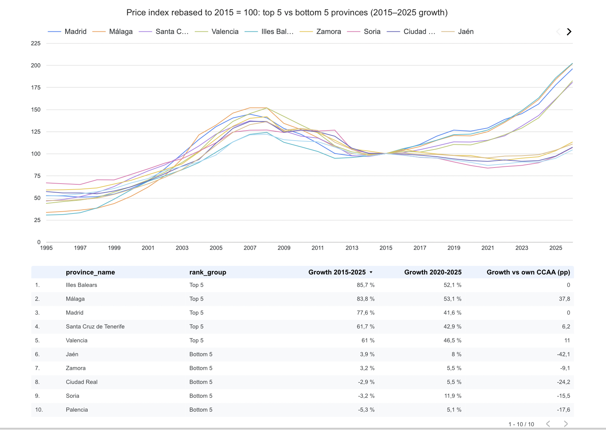
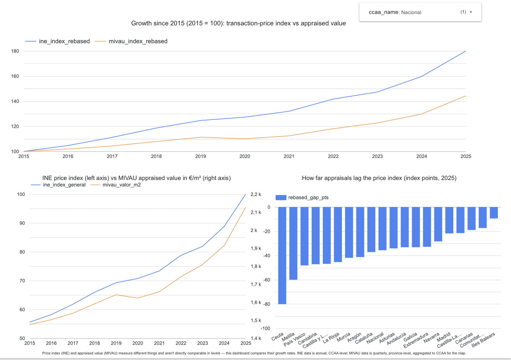

# Spanish Housing Market Analytics Pipeline

**Question:** How has housing price growth diverged across Spanish provinces since 2015, and how does that compare to the broader regional (CCAA) trend?

## The finding

**From 2015 to 2025, appraised housing values grew +44% nationally, but the province-level spread is ~91 percentage points:**

- **Leaders:** Illes Balears **+85.7%**, Málaga **+83.8%**, Madrid **+77.6%**, Santa Cruz de Tenerife **+61.7%**, Valencia **+61.0%** (top-5 average **+74%**).
- **Laggards:** Palencia **−5.3%**, Soria **−3.2%** and Ciudad Real **−2.9%** are *below* their 2015 values. Zamora **+3.2%** and Jaén **+3.9%** are flat (bottom-5 average **−0.9%**).
- **Only 9 of 52 provinces beat the national +44%.** The median province grew **+24%**, so the national figure is pulled up by a handful of coastal and metro markets.

**The divergence is *within* regions, not just between them.** CCAA averages hide it:

| CCAA (region growth) | Fastest province | Slowest province | Gap |
|---|---|---|---|
| Andalucía (+46.0%) | Málaga +83.8% | Jaén +3.9% | **80 pp** |
| Castilla-La Mancha (+21.3%) | Guadalajara +50.4% (Madrid commuter belt) | Ciudad Real −2.9% | **53 pp** |
| Cataluña (+50.5%) | Barcelona +55.2% | Lleida +17.4% | **38 pp** |
| Castilla y León (+12.3%) | Segovia +29.7% | Palencia −5.3% | **35 pp** |

**Transaction prices outran appraisals everywhere.** INE's transaction-price index rose **+79.9%** nationally over the same window, vs **+44.2%** for MIVAU appraised values. The two diverged every year after 2015 (gap −2.8 pts in 2016 → −35.7 pts in 2025), and appraisals lag in **all 19** CCAAs and autonomous cities. The lag is smallest in Illes Balears (−9 pts) and Comunitat Valenciana (−17 pts), and largest in País Vasco (−48 pts), Melilla (−60 pts) and Ceuta (−80 pts).

The recent window is sharper still: from 2020 to 2025, Málaga (+53%), Illes Balears (+52%) and Valencia (+47%) added more than in the five years before.

*All figures: annual means of complete years, 2015 → 2025. Source table: `marts.mart_province_growth_summary`.*

---

## Why this was non-trivial: reconciling two sources across three dimensions at once

| Dimension | INE IPV (table 79540) | MIVAU valor tasado (table 35101000) | How it's reconciled |
|---|---|---|---|
| **Geography** | CCAA only (17 + Ceuta + Melilla + national) | 52 provinces, nested under CCAA headers in the sheet | Hand-built seed (`province_ccaa_mapping`) maps each province to INE codes. The parser rebuilds the hierarchy from row order. |
| **Frequency** | Annual | Quarterly (1995 Q1 – 2026 Q2) | Annual **mean** of quarters (INE's index is an annual average, so mean is like-for-like). Partial years are flagged and excluded from growth. |
| **What's measured** | Hedonic **price index** of transactions, base 2025 = 100 | Average **appraised value** in **€/m²** | **Not comparable in level.** Compared only as *growth*: both rebased to 2015 = 100, or plotted on separate axes. |

The third row matters most. An index of 180 and 2,128 €/m² are different units measuring different things (transaction prices vs. bank valuations). The dashboard never puts them on one un-normalised axis.

### Problems found and handled along the way
- **Hierarchical spreadsheet:** a row is a CCAA header only if it matches a fixed list. Otherwise it's a province of the last header seen. **7 CCAAs have no province rows** (Madrid, Murcia, Navarra, Cantabria, Asturias, Illes Balears, La Rioja), so their CCAA row *is* the province. These are detected from the layout and checked against the expected 7. They're flagged, never dropped or averaged.
- **Inconsistent labels across sheets:** the 2015–2018 sheet spells *"Navarra (Com. Foral de)"*. A naive parser files Navarra as a **province of Murcia** for four years, without any error. A check that all 8 sheets give the same hierarchy caught it. It's now fixed with an explicit alias. An unknown spelling still stops the run.
- **Ceuta y Melilla:** MIVAU publishes them under one combined header. INE treats them as two separate autonomous cities. The split is hardcoded in the seed.
- **Weighted vs. unweighted rollup:** a simple average of provinces understates Cataluña's value by **23%**, because Barcelona dominates transaction volume but counts as 1 of 4 provinces. The CCAA trend therefore uses MIVAU's own published CCAA figure. The unweighted average is kept as a cross-check column.
- **Messy cells:** `n.r` (not representative, 17 province-quarters in 2011–13), blanks (Ceuta/Melilla before 2004), float noise, and an INE CSV that's tab-separated with a byte-order mark and decimal commas. All are handled explicitly and flagged, not dropped.

---

## Architecture



dbt lineage (from `dbt docs`):



### dbt models

| Layer | Model | Grain | Purpose |
|---|---|---|---|
| staging | `stg_ine_ipv` | CCAA × index type × metric × year | English labels → codes (`general`/`new`/`second_hand`) |
| staging | `stg_mivau_valor_tasado` | province × quarter | Typing, quarter date |
| staging | `stg_mivau_valor_tasado_ccaa` | MIVAU CCAA/national × quarter | MIVAU's own published aggregates |
| intermediate | `int_mivau_annual` | geography × year | Quarterly → annual mean, completeness flags |
| intermediate | `int_mivau_by_ccaa` | CCAA × year | Province → CCAA via seed, Ceuta/Melilla split, national row |
| mart | `mart_price_trends_ccaa` | CCAA × year | INE index + MIVAU side by side, both rebased to 2015 = 100, gap |
| mart | `mart_price_trends_province` | province × quarter | €/m², YoY %, rebased index, `province_note` flagging single-province CCAAs |
| mart | `mart_province_growth_summary` | province | 2015→2025 and 2020→2025 growth vs own CCAA, INE and national |

Every mart column is documented in `models/marts/_marts.yml` (70/70, checked against the BigQuery catalog).

---

## Setup and run

**Prerequisites:** Python 3.11+, a Google Cloud project with BigQuery enabled (free tier is enough), and the `gcloud` CLI.

```bash
# 1. Python deps
python -m venv .venv && source .venv/bin/activate
pip install -r ingestion/requirements.txt

# 2. Auth (Application Default Credentials; no key files in the repo)
gcloud auth application-default login
export GCP_PROJECT=<your-gcp-project-id>        # optional; defaults to gcloud's project

# 3. dbt profile
cp dbt_project/profiles.example.yml ~/.dbt/profiles.yml   # then set `project:`

# 4. Run everything: parse → load → dbt seed/run/test → docs
./run_pipeline.sh
```

This creates BigQuery datasets `raw`, `seeds`, `staging`, `intermediate` and `marts` (location EU). Re-running is safe: loads replace tables and dbt rebuilds. To browse docs: `cd dbt_project && dbt docs serve`.

### Test results

73 dbt nodes: 8 models (5 views, 3 tables), 1 seed, 64 data tests. The tests include not-null keys, uniqueness on `(ccaa_code, year)` and `(province_code, year, quarter)`, **relationships tests** (every MIVAU province maps to a seed row, and every mart province to the seed), and 6 custom tests:

| Custom test | Guards against |
|---|---|
| `assert_every_seed_province_has_mivau_data` | A typo in the seed silently dropping a province (reverse relationships test) |
| `assert_seed_matches_parser_hierarchy` | The hand-written seed disagreeing with the hierarchy the parser read from the sheet |
| `assert_ine_ccaa_codes_match_seed` | INE and seed CCAA codes drifting apart |
| `assert_single_province_ccaa_equals_province` | Single-province CCAAs / autonomous cities being averaged or dropped |
| `assert_rebased_indices_equal_100_in_base_year` | Broken rebasing |
| `assert_mart_ccaa_covers_all_geographies` | Missing geography-years (20 × 2007–2025 from both sources) |

```
$ dbt build
...
17:54:27  35 of 73 PASS relationships_stg_mivau_valor_tasado_mivau_province__mivau_province__ref_province_ccaa_mapping_  [PASS in 0.94s]
...
17:54:47  72 of 73 PASS relationships_mart_price_trends_province_province_code__province_code__ref_province_ccaa_mapping_  [PASS in 0.70s]
...
17:54:47  Finished running 1 seed, 3 table models, 64 data tests, 5 view models in 0 hours 0 minutes and 31.02 seconds (31.02s).
17:54:47  Completed successfully
17:54:47  Done. PASS=73 WARN=0 ERROR=0 SKIP=0 NO-OP=0 REUSED=0 TOTAL=73
```
Full log: [`docs/pipeline_run_output.txt`](docs/pipeline_run_output.txt).

---

## Dashboard

Looker Studio, connected directly to the BigQuery `marts` dataset (build spec: [`dashboard/looker_studio_notes.md`](dashboard/looker_studio_notes.md)). The same data model and measures are documented for Power BI in [`dashboard/power_bi_notes.md`](dashboard/power_bi_notes.md).

**Live report: [Looker Studio dashboard](https://datastudio.google.com/reporting/3fd27efc-5b6c-4504-9abe-bb06c93ac6bf)**

**1. Where prices grew:** 2015→2025 growth for all 52 provinces against the national +44.2% line, with a map coloured by regional growth.



**2. Top 5 vs bottom 5 provinces:** appraised value rebased to 2015 = 100, so a 1,000 €/m² province and a 3,700 €/m² province share one scale. The full 1995–2026 history shows the 2007 peak, the bust, and how sharply the top 5 pulled away after 2015 while the bottom 5 dipped after 2015 and by 2025 were back only around their 2015 level (three still below it).



**3. INE price index vs MIVAU appraisals:** both rebased to 2015 = 100 (top); a dual-axis view in native units, with the index on the left and €/m² on the right, never one raw axis (bottom left); and the 2025 gap for every region (bottom right).



---

## Limitations

- **The INE index and MIVAU €/m² are different measures.** INE's IPV is a hedonic (quality-adjusted) index of *transaction* prices from notarial records. MIVAU's figure is the average *appraised* value from bank valuations (made under Spain's ECO/805/2003 rules) per m². Only their growth rates are compared, never their levels. Their divergence is itself a finding. Plausible causes include conservative, lagging appraisal methods and differences in the mix of homes valued vs. sold. This project doesn't test those explanations.
- **MIVAU province values are not quality-adjusted.** A shift in which homes get appraised (e.g. more new-builds) moves the average without any like-for-like price change.
- **Small provinces are noisy.** MIVAU marks some quarters "not representative" (Teruel, Soria, Huesca, Palencia, Cuenca… in 2011–13). Low-volume provinces such as Soria and Palencia, the bottom of the ranking, rest on few appraisals.
- **Annual = mean of quarters.** This matches INE's annual-average convention but smooths turning points. 2026 (Q1–Q2 only) is kept in the data but excluded from all growth figures.
- **No province-level INE data.** INE doesn't publish the IPV below CCAA level, so province-vs-region comparisons use MIVAU for both sides. INE is the regional benchmark only.
- **Nominal values.** No inflation adjustment. Spanish consumer prices rose roughly a quarter over 2015–2025 (INE CPI), so real growth is substantially lower.
- **Unweighted cross-check.** `province_simple_mean` is an unweighted average and is not used for headline figures.

## Repository layout

```
data/raw/                 source files as downloaded (INE 79540.csv, MIVAU 35101000.XLS)
ingestion/                parsers, BigQuery loader, requirements.txt
dbt_project/              seeds/, models/{staging,intermediate,marts}/, tests/, macros/
dashboard/                looker_studio_notes.md, power_bi_notes.md, screenshots/
docs/                     captured pipeline run output
run_pipeline.sh           one-command end-to-end run
```
